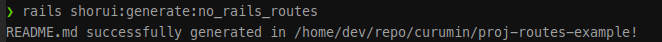

# Proj Routes Example API Documentation

#### [POST] /sessions/create
- **Controller#Action:** `sessions#create`
#### [PUT] /sessions/update
- **Controller#Action:** `sessions#update`
#### [GET] /users
- **Controller#Action:** `users#index`
#### [POST] /users
- **Controller#Action:** `users#create`
#### [GET] /users/new
- **Controller#Action:** `users#new`
#### [GET] /users/:id/edit
- **Controller#Action:** `users#edit`
- **Required Params:** `id`
#### [GET] /users/:id
- **Controller#Action:** `users#show`
- **Required Params:** `id`
#### [PATCH] /users/:id
- **Controller#Action:** `users#update`
- **Required Params:** `id`
#### [PUT] /users/:id
- **Controller#Action:** `users#update`
- **Required Params:** `id`
#### [DELETE] /users/:id
- **Controller#Action:** `users#destroy`
- **Required Params:** `id`
#### [GET] /up
- **Controller#Action:** `rails/health#show`
#### [GET] /recede_historical_location
- **Controller#Action:** `turbo/native/navigation#recede`
#### [GET] /resume_historical_location
- **Controller#Action:** `turbo/native/navigation#resume`
#### [GET] /refresh_historical_location
- **Controller#Action:** `turbo/native/navigation#refresh`
#### [GET] /
- **Controller#Action:** `rails/welcome#index`

### About this generate

This file was generated by command
